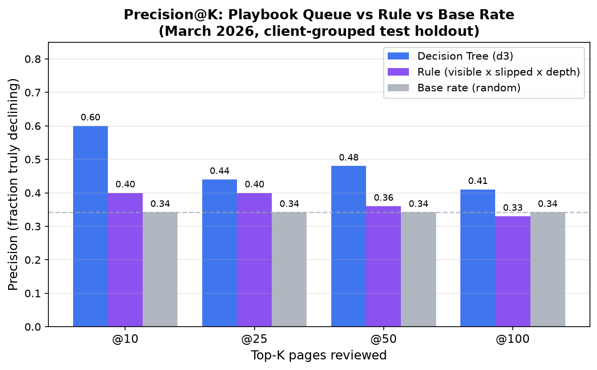

# Capstone Report — Lane 2: Refresh / Content Opportunity Scoring

- **Author:** Hammad
- **Lane:** Lane 2 — Refresh / Content Opportunity Scoring
- **Repo:** https://github.com/iaamhammad/FlyRank_Internship
- **Paper Deployed at:** https://iaamhammad.github.io/FlyRank_Internship/
- **Date:** September 2026

---

### Abstract
Content editors at SEO agencies routinely face a triage problem: with thousands of pages across dozens of client accounts, which ones most urgently need a refresh, expansion, or protection review? This study asks whether observable search-position and engagement signals — available at the time of decision — can predict within-month impression decline with enough precision to meaningfully triage a content queue. Using 32,596 anonymized page-level records from the FlyRank internship warehouse (March 2026), we compare a transparent rule baseline (`visible × slipped × depth`, precision@50 = 0.36) against a depth-3 decision tree trained on six leakage-free features, evaluated on a client-grouped holdout of six unseen clients. The decision tree achieves a precision@50 of 0.48 on held-out clients (vs. 0.36 for the rule and 0.34 base rate), with a repeated 5-seed mean of 0.304 — indicating a real but modest and variable signal. These results address a concrete FlyRank content problem: giving editorial teams a principled, data-driven queue so they spend sprint hours on pages most likely to benefit from a refresh — not on pages already holding position — with position depth confirmed as the strongest available triage signal and cross-client validation revealing the limits of generalizing from a single month of data.

---

## 1. Problem framing

An SEO agency managing 30 client accounts can have over 30,000 indexed pages in its portfolio at any moment. A single account can carry 7,000 pages. No editorial team can review every page in a standard bi-weekly sprint cycle. The central question is therefore not simply *which pages are declining* (which can be observed in retrospective analytics), but *which pages should a human content strategist review first this cycle?*

- **Unit of analysis:** One page-level record per (client, content) pair aggregated over a one-month snapshot window (March 2026).
- **Output:** A prioritized, ranked queue per client with explicit reason codes (`position_risk_with_demand`, `aging_page_one`, `refresh_review`, `monitor`) and predicted decline probabilities.
- **Action taken by human:** Content strategists pull the top-N rows (capped at 25–50 pages per sprint) to conduct intent audits, check SERP displacement (e.g., AI Overviews, featured snippets), and assign editorial tasks: refresh, expand, protect, or monitor.
- **Cost of wrong calls:**
  - *False Positive:* Wastes valuable writer and editor hours researching and revising content that was already performing stably.
  - *False Negative:* Allows high-value decaying pages to silently lose search traffic and revenue until an audit months later notices the collapse.
- **Why ML helps:** While simple heuristic rules capture obvious deep-position pages, they fail on non-linear interactions (e.g., page age vs. engagement vs. position) and cannot assign calibrated priority probabilities across thousands of borderline pages.

**This is FlyRank's content refresh triage problem in its practical form.** An SEO platform managing hundreds of client websites needs a repeatable, auditable method to surface the highest-priority pages for editorial action each sprint — pages where a timely refresh or expansion can recover lost search impressions before traffic erosion compounds. Our findings show that a shallow, interpretable decision tree trained on position and engagement signals can outperform expert-designed rules on new clients, while making the reasons behind every recommendation transparent to editors.

---

## 2. Data safety

All analysis is performed on the FlyRank internship warehouse (`hf://datasets/FlyRank/internship-warehouse`), focusing on the March 2026 partition of `fact_content_daily_performance` joined with `dim_content`.

- **Cohort filters:** We require `ga4_data_available IS TRUE AND gsc_data_available IS TRUE`, dropping 171 records missing `avg_position` (<1%) and filtering to pages with $\ge 100$ monthly GSC impressions. This yields 32,596 pages across 30 client accounts.
- **Deliberately excluded columns:**
  - `trend_direction` and `trend_pct`: These columns define or derive from the target label. Using them as features would introduce direct target leakage.
  - Client domain names and raw URLs: All records use pseudonymous hashes (`client_hash_id`, `content_hash_id`). No client-identifying or proprietary text exists in `work/` or committed artifacts.
  - `content_updated_date`: Using raw forward-dated update timestamps introduces temporal leakage. We apply a verified clamp: `GREATEST(days_since_last_update, 0)`.
  - April 2026 partition: Excluded from all model training and test splits; reserved strictly as a temporal validation audit.

---

## 3. Baseline

The reference pipeline establishes a transparent, hand-crafted heuristic rule baseline: `visible × slipped × depth`.

- **Rule logic:** Flags a page if `gsc_impressions >= 500` (meaningful search demand), `avg_position >= 10` (fallen off page one or deep), and has recorded engagement. Reason code assigned: `position_risk_with_demand`.
- **Why it is a fair comparison:** It mirrors real-world agency triage rules: filter for pages with enough search volume that ranking deep represents an immediate traffic opportunity or risk.
- **Baseline performance:**
  - Full March slice: Flags 8,490 pages (26.0% of all pages). Base rate of decline is 26.8%.
  - On the client-grouped test holdout (seed 42, 6 held-out clients, 4,495 rows, base rate 34.2%):
    - `precision@10` = 0.40
    - `precision@25` = 0.40
    - `precision@50` = 0.36
    - `precision@100` = 0.33
    - `ROC-AUC` = 0.433
  - Across 5 repeated client splits (seeds 0–4): Mean `precision@50` = 0.232 (vs. mean base rate 0.183).

---

## 4. Model / analysis

We evaluated three candidate architectures: Logistic Regression (L2 penalty), Decision Tree (`max_depth=3`, `class_weight='balanced'`, `min_samples_leaf=50`), and Random Forest (100 estimators).

- **Selected model:** Depth-3 Decision Tree (`random_state=42`). A shallow tree was selected because:
  1. It provides fully interpretable, inspectable decision rules suitable for agency stakeholders.
  2. It demonstrated superior precision at top-K on unseen clients compared to complex ensembles that tended to overfit client specifics.
- **Label definition (in one sentence):** `is_declining_label = 1` if a page's total GSC impressions in the second half of March 2026 (days 16–31) are strictly less than in the first half (days 1–15).
- **Exact feature contract (6 leakage-free features):**
  1. `content_age_days`: Days elapsed since initial page publication.
  2. `days_since_last_update`: Days since last content modification, clamped $\ge 0$.
  3. `avg_position_mar`: Average Google Search Console position across March.
  4. `log_gsc_impressions_mar`: $\log(1 + \text{impressions})$ demand volume.
  5. `engagement_rate_mar`: GA4 engaged sessions divided by total sessions $\times 100$.
  6. `has_engagement`: Binary indicator flag for whether GA4 tracked sessions.

---

## 5. Evaluation

We used a **client-grouped holdout split** (80% train / 20% test: 24 training clients, 6 held-out test clients; 4,495 test rows). 

- **Why client-grouped:** In production, the model is deployed on new clients. A standard random row split leaks client-level baseline conversion and volume distributions into the training set (inflating Random Forest AUC to 0.738). Grouping by client strictly tests generalization to unobserved websites.
- **Comparative metrics on the same split (Seed 42 holdout):**

| Model | p@10 | p@25 | p@50 | p@100 | ROC-AUC |
|---|---|---|---|---|---|
| Base Rate (Random Chance) | 0.342 | 0.342 | 0.342 | 0.342 | 0.500 |
| Rule Baseline (`visible × slipped × depth`) | 0.40 | 0.40 | 0.36 | 0.33 | 0.433 |
| Logistic Regression | 0.40 | 0.32 | 0.30 | 0.33 | 0.492 |
| **Decision Tree (depth 3) [Keeper]** | **0.60** | **0.44** | **0.48** | **0.41** | **0.501** |
| Random Forest | 0.30 | 0.24 | 0.22 | 0.30 | 0.515 |

- **Stability across 5 random client seeds:**
  - Decision Tree Mean `p@50`: **0.304** (range 0.10–0.46)
  - Rule Baseline Mean `p@50`: **0.232**
  - Holdout Mean Base Rate: **0.183**
- **Error analysis:**
  - Errors at top-K are primarily driven by external volatility: pages in volatile query spaces that suffered a 1-week dip in early March before bouncing back.
  - As review depth expands from $K=50$ to $K=100$, precision drops from 0.48 to 0.41, illustrating why sprint queues must be capped tightly.

---

## 6. Interpretation

- **Position is the primary signal; impressions are a demand gate:**
  - Auditing signals by bucket revealed a monotonic decline relationship with Google position: pages at position 1–3 decline at 13.8%, rising steadily to **42.9%** for positions 21–50.
  - In contrast, impression volume tiers exhibited a flat decline profile (25.1% to 28.2%), proving that volume does not signal decay by itself, but rather establishes business impact.
- **Negative result on staleness:** `days_since_last_update` showed median = 0 in March 2026 data due to recent CMS bulk touches across multiple clients, providing zero discriminative power in this specific observation window.
- **Queue profile:** The decision tree surfaces **9,329 model-only candidates** (scored $\ge 0.5$) that fell below the strict rule threshold (e.g. `aging_page_one` pages at position 4–9 that have high age and softening engagement), expanding opportunity discovery beyond simple position rules.

---

## 7. Recommendation

We provide a ranked action playbook for agency editors:

1. **Rank 1 (Urgent): High-demand deep pages (`high_demand_deep`).** $\ge 3,000$ impressions and position $\ge 10$. 3,245 pages with a **48.9% decline rate** (100% rule flagged). Immediate SERP intent audit.
2. **Rank 2 (Medium): Low-demand deep pages (`low_demand_deep`).** 10,787 pages; position $\ge 10$, $< 3,000$ impressions; 34.8% decline rate. Process in bi-weekly batches of 25–50 after confirming query search volume still exists.
3. **Rank 3 (Process): Cap review queue at 25–50 rows per sprint.** Precision degrades significantly past row 50 ($0.48 \to 0.41$).
4. **Rank 4 (Secondary): Review model-only aging pages (`aging_page_one`).** Position $< 10$, age $> 180$ days, low engagement. 22.4% decline rate; inspect for SERP feature displacement.
5. **Rank 5 (Maintenance): Automated retrain triggers.** Retrain model if:
   - Portfolio base rate shifts $> 5$ percentage points from 26.8%.
   - Model age exceeds 2 months.
   - Validation `p@50` drops below 0.30.

*What should NOT be automated:* Triage is strictly decision-support. Editors must verify query intent and distinguish true ranking decay from SERP layout changes (e.g. Knowledge Graphs, AI Overviews) before initiating rewrites.

---

## 8. Reproducibility

- **Clone & run environment:**
  ```bash
  git clone https://github.com/iaamhammad/FlyRank_Internship.git
  cd FlyRank_Internship
  pip install -r requirements.txt
  pip install nbformat nbclient ipykernel jupyter
  ```
- **Secrets:** Store token in `.env`: `HF_token=hf_your_token_here`
- **Execute pipeline & capstone:**
  ```bash
  # Run offline reference pipeline (~1 min)
  python scripts/run_all.py
  
  # Run capstone notebook top-to-bottom
  python -m jupyter nbconvert --to notebook --execute --inplace work/notebooks/capstone.ipynb
  ```
- **Random seed:** Fixed at `RANDOM_STATE = 42` for primary splits and 0–4 for stability seeds.
- **Metric receipts:** Committed in `work/outputs/w04_baseline_metrics.json`, `w05_model_metrics.json`, `w06_validation_audit_metrics.json`, and `w07_playbook_metrics.json`.

---

## Acknowledgments & Data Credit

This research was conducted as part of the **FlyRank ML Internship Program**. All search analytics data used in this study is sourced from the **FlyRank ML Internship dataset**, a research dataset derived from real production search performance data.

> **Built on the FlyRank ML Internship dataset**  
> Data source & platform: [https://flyrank.ai](https://flyrank.ai)  
> Warehouse repository: `hf://datasets/FlyRank/internship-warehouse`  

---

## 9. Week-8 Demo Outline (5 min)

*A compact script for the showcase: question → method → one chart → one honest result → one recommendation.*

### The question (30 sec)
SEO agencies manage tens of thousands of pages across dozens of clients. No editorial team can review them all. The question: **can search-position and engagement signals, observed at sprint start, predict which pages are declining — well enough to triage a useful content queue?**

### The method (60 sec)
- **Data:** 32,596 page-level records from the FlyRank internship warehouse (March 2026, 30 clients).
- **Label:** `is_declining_label = 1` if a page’s impressions fell from the first to the second half of March.
- **Six leakage-free features:** avg. search position, log impressions, engagement rate, content age, days since last update, engagement flag.
- **Validation:** Client-grouped holdout (6 unseen clients). Random row splits inflate scores — we used the deployment-realistic split.
- **Baseline:** Hand-coded rule (`visible × slipped × depth`). Every model compared on the same split.

### One chart (60 sec)
**Figure 1: Precision@K — Rule vs. Decision Tree on held-out test clients**

*The decision tree (depth 3) outperforms the rule baseline at every K from 10 to 100. Precision drops after row 50 — capping sprint queues at 25–50 rows maintains quality.*

### One honest result (60 sec)
The depth-3 decision tree achieves **precision@50 = 0.48** on held-out clients (vs. 0.36 for the rule, 0.34 base rate). That’s encouraging — but the 5-seed mean is **0.304** with a range of 0.10–0.46. What that means: with only 30 clients and 6 held out, split composition matters. The model has real but variable signal. It is a decision-support tool, not an autonomous prediction system.

### One recommendation (30 sec)
**Cap review queues at 25–50 pages per sprint and use a hybrid rule + model approach.** The rule catches urgent deep-position pages (48.9% decline rate); the model adds 9,329 aging page-one candidates the rule misses. Together they give editors a principled, auditable queue — with reason codes, not black-box scores.

---

## 10. Shareable Cuts

*Two audience-specific framings of the same work, ready to share as-is.*

### Social post (LinkedIn / X)
> I spent the last 8 weeks building a content-refresh triage system on 32,596 real search-performance records from the FlyRank ML Internship dataset.
>
> The problem: SEO teams can’t review 30,000 pages per sprint. Which ones actually need a refresh?
>
> Key findings:
> - Search **position depth** is the strongest signal (pages at pos. 21–50 decline at 42.9%; pages at pos. 1–3 decline at 13.8%)
> - Impression **volume** is nearly flat across decline rates — it’s a demand gate, not a decay signal
> - A depth-3 decision tree hit **precision@50 = 0.48** on unseen clients vs. 0.36 for a hand-coded rule
> - 5-seed mean: 0.304 — real signal, honest variance
>
> Biggest lesson: random row splits inflate AUC from 0.50 to 0.74. Client-grouped holdouts tell the truth.
>
> Paper: https://iaamhammad.github.io/FlyRank_Internship/  
> Repo: https://github.com/iaamhammad/FlyRank_Internship  
>
> #MachineLearning #SEO #ContentStrategy #DataScience #MLInternship

### Employer 3-sentencer
> I built and validated a content-refresh triage system using 32,596 anonymized page-level search records from a real SEO platform (FlyRank’s internship warehouse, covering 30 client accounts). I trained a depth-3 decision tree on six leakage-free features — search position, impressions, engagement rate, and content age — validated with a client-grouped holdout that tests generalization to entirely new clients. The model achieved precision@50 of 0.48 on held-out clients (vs. 0.36 rule baseline), with a 5-seed mean of 0.304, confirming a real but variable signal and demonstrating that position depth, not content volume, is the primary triage driver for editorial content queues.

